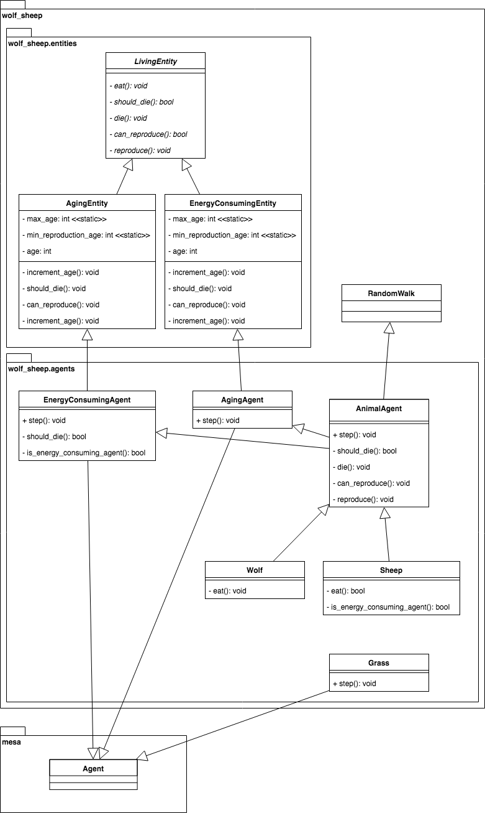

# Wolf-Sheep Predation Model

## Summary

A simple ecological model, consisting of three agent types: wolves, sheep, and grass. The wolves and the sheep wander around the grid at random. Wolves and sheep both expend energy moving around, and replenish it by eating. Sheep eat grass, and wolves eat sheep if they end up on the same grid cell.

If wolves and sheep have enough energy, they reproduce, creating a new wolf or sheep (in this simplified model, only one parent is needed for reproduction). The grass on each cell regrows at a constant rate. If any wolves and sheep run out of energy, they die.

In this modified version, both wolves and sheep age at every step, and they die when they become 20 years old.

## Installation

To install the dependencies use pip and the requirements.txt in this directory. e.g.

```
    $ pip install -r requirements.txt
```

## How to Run

To run the model interactively, run ``run.py`` in this directory. e.g.

```
    $ python run.py
```

Then open your browser to [http://127.0.0.1:8521/](http://127.0.0.1:8521/) and press Reset, then Run.

## Class diagram

There has been some changes over the classes in this new version: new classes have been added in order to keep them more concrete and small and to apply DRY. The class diagram has been designen taking advantage of Python's multi-inheritance capabilities.



## Files

### New files

* ``wolf_sheep/entities/living_entity.py``: Defines a living entity. It provides abstract methods to be used as a template when implementing subclasses.
* ``wolf_sheep/entities/energy_consuming_entity.py``: Defines an energy consuming entity and implements some ``LivingEntity`` methods related to energy levels and consumtion.
* ``wolf_sheep/entities/aging_entity.py``: Defines an aging entity and implements some ``LivingEntity`` methods related to age.
* ``wolf_sheep/agents/energy_consuming_entity.py``: Defines an energy consuming ``Agent`` and implements the step method. It re-implements the methods of ``EnergyConsumingEntity`` in order to allow subclasses to easily deactivate the energy handling capabilities.
* ``wolf_sheep/agents/aging_agent.py``: Defines an aging ``Agent`` and implements the step method.
* ``wolf_sheep/agents/animal_agent.py``: Defines an animal ``Agent``. Implements some of the missing methods of ``LivingEntity`` and re-implements others.

### Modified files

* ``wolf_sheep/agents.py -> wolf_sheep/agents/agents.py``: Defines the ``Wolf``, ``Sheep``, and ``GrassPatch`` agent classes. ``Wolf`` and ``Sheep`` have been refactored so they are implemented by inheriting the newly added ``AnimalAgent`` class, and they also implement the ``_eat`` method.
* ``wolf_sheep/model.py``: Defines the Wolf-Sheep Predation model itself. Added age related parameters, and also a method function so randomization on agent reproduction is encapsulated whithin the model itself.
* ``wolf_sheep/server.py``: Sets up the interactive visualization server. Added age related inputs so they can be changed from the client, render chart with average ages for each animal agent.

### Previously existing and non modified files

* ``wolf_sheep/random_walker.py``: This defines the ``RandomWalker`` agent, which implements the behavior of moving randomly across a grid, one cell at a time. Both the Wolf and Sheep agents will inherit from it.
* ``wolf_sheep/test_random_walk.py``: Defines a simple model and a text-only visualization intended to make sure the RandomWalk class was working as expected. This doesn't actually model anything, but serves as an ad-hoc unit test. To run it, ``cd`` into the ``wolf_sheep`` directory and run ``python test_random_walk.py``. You'll see a series of ASCII grids, one per model step, with each cell showing a count of the number of agents in it.
* ``wolf_sheep/schedule.py``: Defines a custom variant on the RandomActivation scheduler, where all agents of one class are activated (in random order) before the next class goes -- e.g. all the wolves go, then all the sheep, then all the grass.
* ``run.py``: Launches a model visualization server.

## Further Reading

This model is closely based on the NetLogo Wolf-Sheep Predation Model:

Wilensky, U. (1997). NetLogo Wolf Sheep Predation model. http://ccl.northwestern.edu/netlogo/models/WolfSheepPredation. Center for Connected Learning and Computer-Based Modeling, Northwestern University, Evanston, IL.

See also the [Lotka–Volterra equations
](https://en.wikipedia.org/wiki/Lotka%E2%80%93Volterra_equations) for an example of a classic differential-equation model with similar dynamics.
